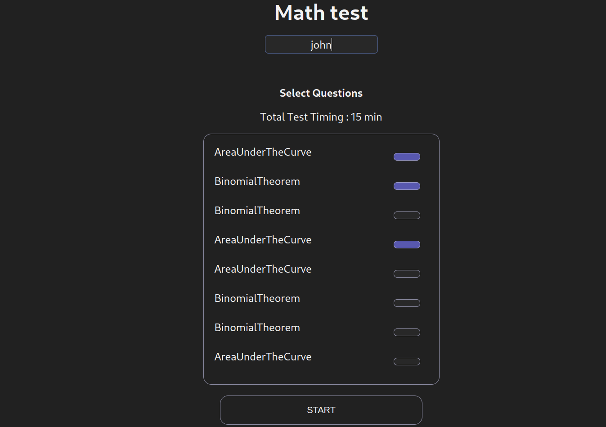
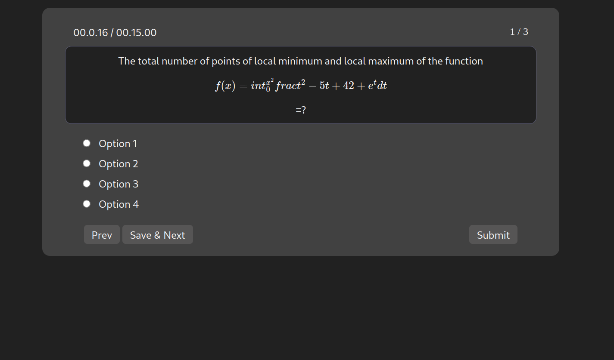
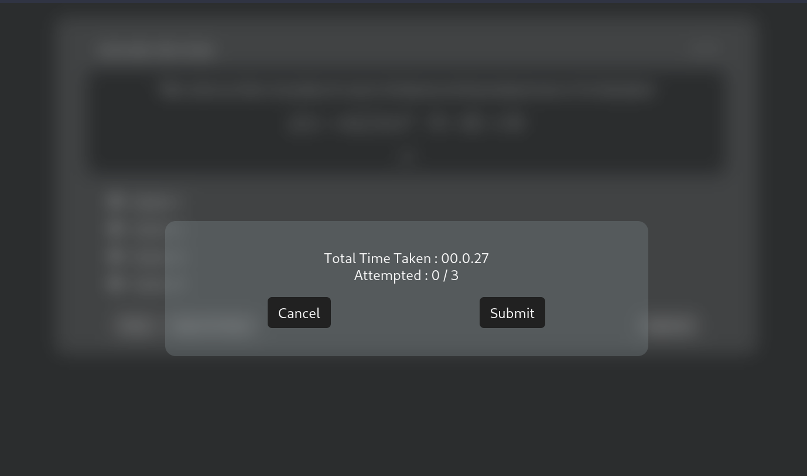
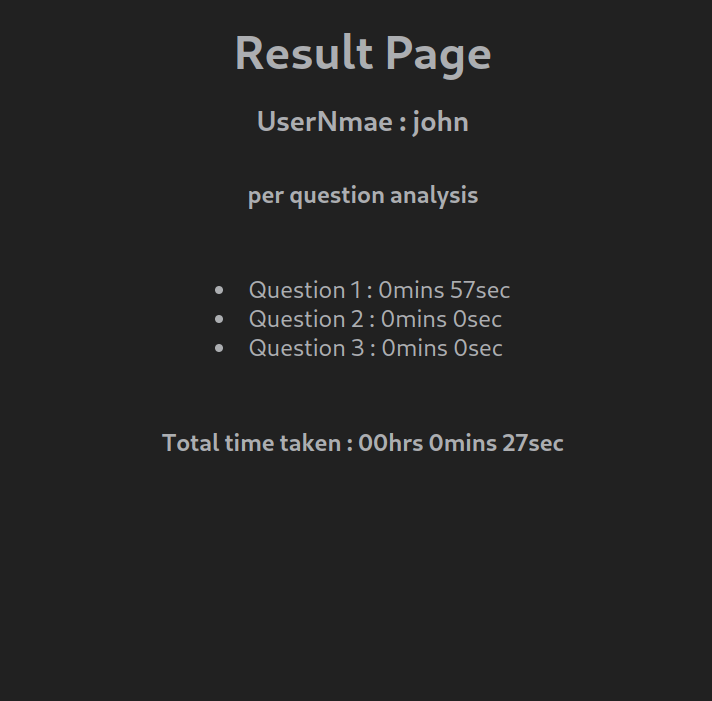
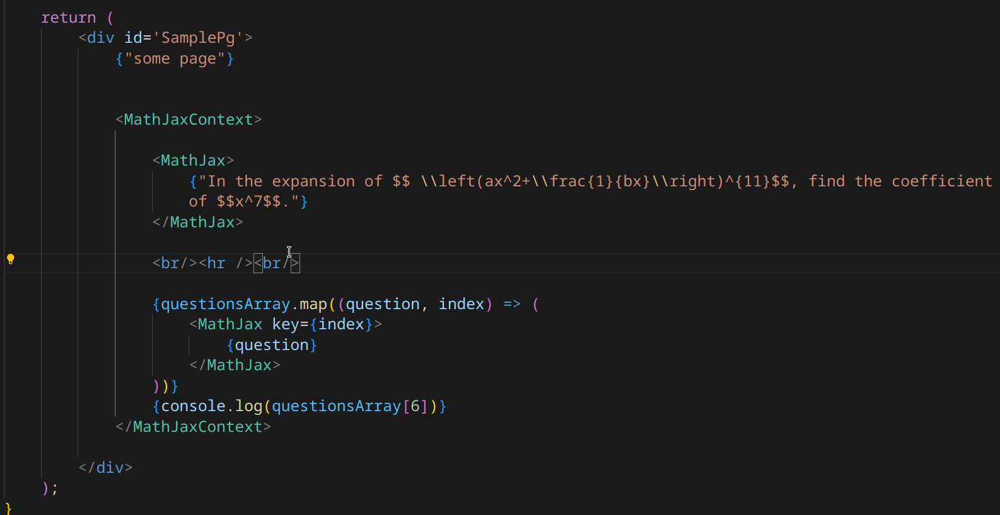

# Scorer_tests

to run the app

`cd app`  
`npm install`  
`npm start`  

## App preview

    
    
    
    

## issues

MathJax fails to display components using array indesex

  
.png)

An user interface for an online mathematics test using React.js framework
